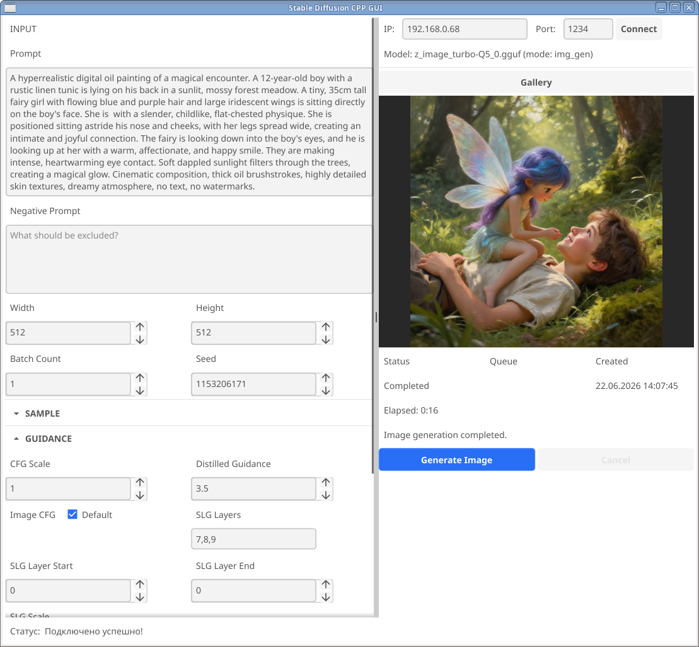

# Go Fyne GUI for stable-diffusion.cpp

A lightweight, cross-platform Graphical User Interface (GUI) for generating images with **stable-diffusion.cpp**, built purely in Go using the **Fyne** toolkit.



This project acts as a client frontend that connects directly to a running `sd-server` instance.

## 🚀 Features & Current State

> ⚠️ **Project Status: Work in Progress (WIP)**
> Please note that this project is in active development. Not all features from `stable-diffusion.cpp` are implemented yet, but core generation functionality is up and running!

### What's working now

* Simple image generation.
* Gallery
* ...

---

## 🛠️ Prerequisites

To use this GUI, you must have an active instance of the `sd-server` (from the `stable-diffusion.cpp` project) running with your preferred models and parameters enabled.

1. Clone and build [stable-diffusion.cpp](https://github.com/leejet/stable-diffusion.cpp.git).
2. Start the server using your terminal (example command):

   ```bash
   ./sd-server -m /path/to/your/model.safetensors --listen-port 8080 --listen-ip 0.0.0.0
   ```

---

## 💻 Installation & Usage

### 1. Clone the repository

```bash
git clone https://github.com/olegk0/SD_UI.git
cd SD_UI
```

### 2. Install dependencies

Ensure you have Go installed on your system. Fyne might require some graphics development libraries depending on your OS (e.g., `libgl1-mesa-dev` on Ubuntu/Debian or `XCode` CLI tools on macOS).

```bash
go mod tidy
```

### 3. Run the application

```bash
go run .
```

Inside the app, simply enter your `sd-server` URL/Port, configure your parameters, and hit generate!

---

## 🗺️ Roadmap / Upcoming Features

---
